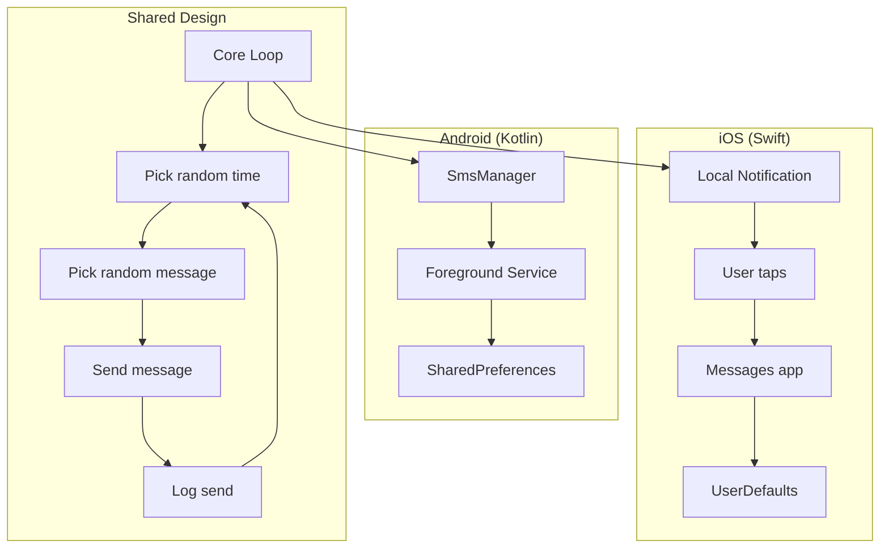
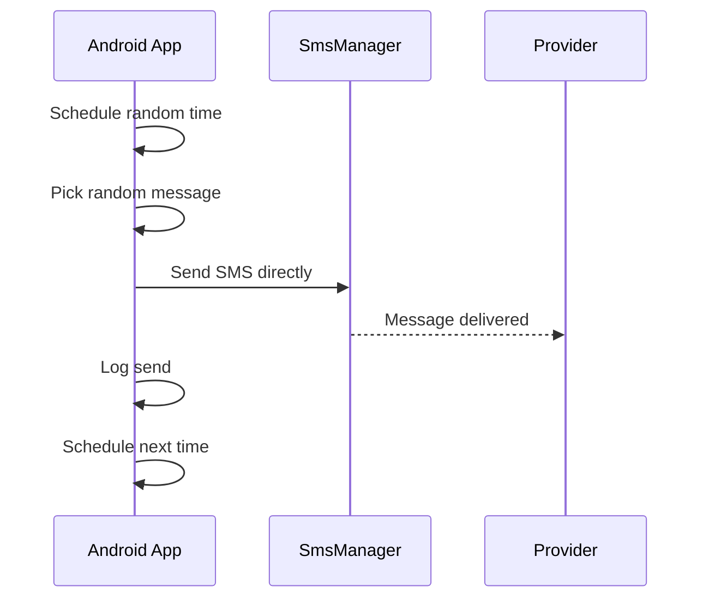
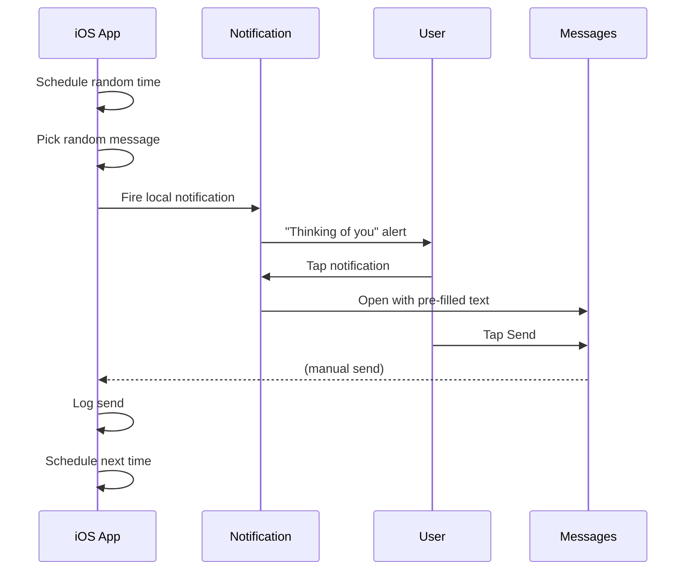

# landonkea-thinkLessScheduleMore — Design & Workflow

## High-Level Overview

## Android Flow

## iOS Flow

## File Relationships

| File | Purpose | Platform |
|------|---------|----------|
| `android/` | Kotlin app | Android |
| `ios/` | Swift app | iOS |
| `shared/ARCHITECTURE.md` | Design notes | Both |
| `scripts/run_all_tests.sh` | Test runner | CI |

## draw.io

[Open in draw.io](https://app.diagrams.net/#RMessage%20scheduling%20architecture)
